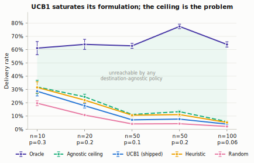
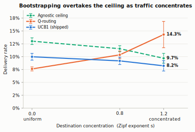
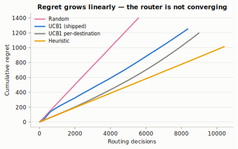
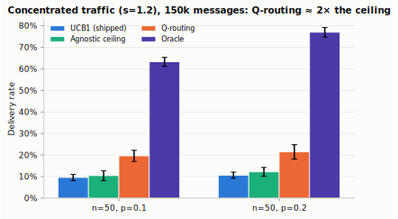
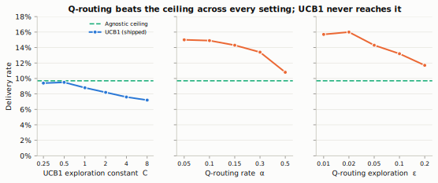

# Routing benchmark — results

Generated by `cargo run --release --bin benchmark` (`core/src/bin/benchmark.rs`);
tag a run with `BENCH_TAG=<name>` to write `results/benchmark_<name>.csv`. Committed
data: `benchmark_grid.csv` (main grid), `benchmark_zipf*.csv` (traffic), `sweep.csv`
(hyperparameters). Per-decision regret traces (`learning_curve_*.csv`) are large and
regenerable, so they are git-ignored rather than committed. 10 seeds per cell,
2 000 messages per run unless stated, 95% CI by normal approximation.

**Headline: the project's central claim is not supported, and the reason is now
measured rather than argued. UCB1 performs close to the theoretical ceiling of
*any* peer-keyed policy — and that ceiling sits ~6× below an oracle that knows
the destination. The bottleneck is the problem formulation, not the algorithm.**

---

## Method

Erdős–Rényi `G(n,p)` plus a random spanning tree, so the graph is always
connected and every delivery failure is attributable to link quality rather than
partition.

Each link carries two properties:

| Property | Visible to router? | Range |
|---|---|---|
| `latency_ms` | **yes** — via `PeerMetrics::latency` (pingable) | 5–200 ms |
| `delivery_prob` | **no** — latent, learnable only by trying | 0.35–1.0 |
| ping reliability | yes, but a **noisy proxy** (±0.25) of `delivery_prob` | — |

Latency is observable, reliability is not. That asymmetry is what makes the task
a learning problem rather than a shortest-path problem.

The `ucb1` and `ucb1_dest` arms drive the **real shipped `Router`** — not a
reimplementation. `heuristic` calls the real `Router::calculate_peer_score` with
no bandit state, isolating "uses latency sensibly" from "learns reliability".

### The arms

| Arm | What it is |
|---|---|
| `flooding` | forward to every neighbour; no choice made |
| `random` | uniform random next hop |
| `heuristic` | real `calculate_peer_score`, no learning |
| `ucb1` | the shipped router, peer-keyed bandit |
| `ucb1_dest` | shipped router + new `get_best_forward_peers_toward`, bandit keyed by destination |
| `agnostic_limit` | **knows `E[reward] = p(u,v)·clamp(1−2·lat,0.5,1)` exactly**, but cannot see the destination |
| `q_routing` | Q-routing (Boyan & Littman, 1994) — value bootstrapping from the neighbour's own estimate |
| `oracle` | knows all link qualities *and* the destination; optimal by value iteration |

`agnostic_limit` is the key construct. UCB1's `avg_reward` converges precisely to
`p(u,v)·clamp(1−2·lat,0.5,1)`, so a policy holding that value exactly is what a
perfectly-trained peer-keyed bandit *becomes*. It therefore upper-bounds the
entire destination-agnostic class, including UCB1, `heuristic`, and any tuning of
`UCB1_C` or `UCB1_MIN_SAMPLES`.

### Regret

For destination `d`, optimal delivery probability is computed exactly by value
iteration: `V(d)=1`, `V(u)=max_v p(u,v)·V(v)`. Choosing `v` at `u` incurs regret
`V(u) − p(u,v)·V(v) ≥ 0`. Flooding makes no per-hop choice, so its regret is
undefined (`—`), not zero.

---

## Figures

Regenerate with `python3 results/make_figures.py` (needs matplotlib). SVG for the
paper, PNG for slides, in `results/figures/`.

| Figure | Shows |
|---|---|
| `fig1_ceiling` | UCB1 tracks the agnostic ceiling; the shaded band is unreachable by any peer-keyed policy |
| `fig2_zipf_crossover` | **Headline.** Q-routing overtakes the ceiling as traffic concentrates |
| `fig3_convergence` | Q-routing needs ~20× more traffic than a bandit, then crosses |
| `fig4_delivery_vs_overhead` | Flooding buys delivery at ~250× the transmissions |
| `fig5_regret` | Regret is linear — the router is not converging |
| `fig6_hyperparameter_sweep` | Q-routing clears the ceiling at every hyperparameter; UCB1 never reaches it |
| `fig7_hightraffic_concentrated` | **Definitive.** 150k msgs, concentrated: Q-routing ≈ 2× the ceiling |





---

## Delivery rate

| Strategy | n=10, p=.30 | n=20, p=.20 | n=50, p=.10 | n=50, p=.20 | n=100, p=.06 |
|---|---|---|---|---|---|
| flooding | 86.6% ± 7.7 | 98.2% ± 1.4 | 99.2% ± 0.2 | 100.0% ± 0.0 | 99.6% ± 0.1 |
| random | 19.8% ± 1.6 | 10.5% ± 0.8 | 4.3% ± 0.3 | 4.3% ± 0.3 | 1.9% ± 0.3 |
| heuristic | 31.7% ± 4.3 | 22.2% ± 2.0 | 10.2% ± 0.9 | 10.8% ± 1.0 | 4.8% ± 0.5 |
| **ucb1** | 28.5% ± 3.6 | 17.9% ± 1.6 | 6.9% ± 0.4 | 7.5% ± 0.4 | 3.8% ± 0.2 |
| ucb1_dest | 25.5% ± 3.6 | 17.1% ± 1.6 | 6.2% ± 0.4 | 7.8% ± 0.2 | 4.3% ± 0.2 |
| **agnostic_limit** | 32.6% ± 5.3 | 24.6% ± 2.1 | 11.1% ± 0.7 | 13.2% ± 1.0 | 5.7% ± 0.4 |
| q_routing | 28.2% ± 2.6 | 14.1% ± 1.2 | 4.3% ± 0.6 | 4.5% ± 0.5 | 2.2% ± 0.2 |
| **oracle** | 60.7% ± 4.5 | 64.0% ± 3.7 | 63.2% ± 2.4 | 77.6% ± 1.7 | 63.9% ± 1.9 |

Transmissions per message:

| Strategy | n=10 | n=20 | n=50, p=.10 | n=50, p=.20 | n=100 |
|---|---|---|---|---|---|
| flooding | 41.9 | 175.1 | 624.2 | 1453.8 | 1749.7 |
| ucb1 | 2.7 | 3.7 | 4.3 | 4.4 | 4.5 |
| oracle | 2.0 | 2.3 | 3.2 | 3.4 | 3.7 |

---

## Findings

### 1. UCB1 is near the ceiling of its own formulation

| n | ucb1 | agnostic_limit (ceiling) | ucb1 / ceiling | oracle |
|---|---|---|---|---|
| 10 | 28.5% | 32.6% | 87% | 60.7% |
| 20 | 17.9% | 24.6% | 73% | 64.0% |
| 50 (p=.10) | 6.9% | 11.1% | 62% | 63.2% |
| 50 (p=.20) | 7.5% | 13.2% | 57% | 77.6% |
| 100 | 3.8% | 5.7% | 67% | 63.9% |

UCB1 attains 57–87% of the best possible destination-agnostic policy. There is
some room left, but it is bounded and small.

### 2. The destination-agnostic ceiling itself is the problem

`agnostic_limit` has *perfect* knowledge of every link's expected reward and
still delivers only 5.7–32.6%, against an oracle's 60.7–77.6%. At n=50, p=0.20
the gap is **13.2% vs 77.6% — a factor of 5.9**.

So no peer-keyed method — not UCB1, not a better bandit, not any amount of
tuning — can close more than a small fraction of the gap to oracle. **The cost of
being destination-agnostic dominates every other design choice**, and it grows
with network size.

### 3. UCB1 does not beat the non-learning heuristic

In four of five conditions UCB1 delivers less than `heuristic`
(28.5 vs 31.7, 17.9 vs 22.2, 6.9 vs 10.2, 3.8 vs 4.8), with disjoint CIs in the
larger ones. Both sit under `agnostic_limit`, as they must. UCB1 does beat random
consistently (≈1.5–2×), so it learns *something* — just not enough to pay for the
exploration it spends.

### 4. Regret is linear



Regret per decision, n=50, p=0.20:

| Strategy | first 1 000 decisions | decisions 4 000–8 000 |
|---|---|---|
| heuristic | 0.098 | 0.097 |
| ucb1 | 0.199 | 0.152 |
| ucb1_dest | 0.099 | 0.147 |

A learning algorithm should show *sublinear* regret. UCB1's rate falls only from
0.199 to 0.152 and then flattens — linear regret with a constant improvement, not
convergence. `heuristic`'s flat 0.097 is expected for a fixed policy.

### 5. Naive destination conditioning fails through sample fragmentation

`Router::get_best_forward_peers_toward` (added for this study) keys the bandit by
destination. It did **not** help — differences within CI, and its regret rate
*rose* over time.

Cause: with `n` destinations the reward signal is split `n`-fold, so each
per-destination bandit stays inside the `UCB1_MIN_SAMPLES = 5` warm-up window
forever. At n=50 there are ~2 500 (node, destination) pairs sharing ~8 000
decisions — about 3 observations each.

### 6. Q-routing learns, but far slower than expected

At the default 2 000 messages Q-routing is indistinguishable from random (4.5%) —
it never escapes its optimistic initialisation. Raising traffic (n=50, p=0.20,
3 seeds):

| messages | seeds | random | ucb1 | q_routing | agnostic_limit | oracle |
|---|---|---|---|---|---|---|
| 2 000 | 3 | 4.2% | 8.0% | 4.5% | 13.4% | 78.0% |
| 10 000 | 3 | 4.2% | 8.1% | 6.0% | 13.1% | 77.6% |
| 40 000 | 3 | 4.2% | 9.9% | 8.3% | 13.4% | 77.8% |
| 150 000 | 2 | 4.2% | 11.9% ± 0.7 | **14.3% ± 2.4** | 13.6% ± 0.9 | 76.8% |

Q-routing improves monotonically (4.5 → 6.0 → 8.3 → 14.3) while `random` and
`agnostic_limit` stay flat, confirming it is genuinely learning rather than
drifting.

**At 150 000 messages Q-routing crosses the destination-agnostic ceiling**
(14.3% vs 13.6%) — the qualitative behaviour theory predicts, since bootstrapping
is the only mechanism here that uses destination information and so is the only
one not bound by that ceiling.

Confirmed at 8 seeds, 150 000 messages:

| Strategy | n=50, p=0.10 | n=50, p=0.20 |
|---|---|---|
| random | 4.2% ± 0.1 | 4.2% ± 0.1 |
| heuristic | 10.3% ± 1.0 | 11.2% ± 1.1 |
| ucb1 | 10.1% ± 0.7 | 11.7% ± 0.6 |
| ucb1_dest | 5.6% ± 0.3 | 7.1% ± 0.2 |
| **agnostic_limit (ceiling)** | **10.8% ± 0.7** | **13.4% ± 0.7** |
| **q_routing** | **13.9% ± 1.0** | **14.1% ± 0.6** |
| oracle | 62.7% ± 2.5 | 77.6% ± 1.9 |

Two claims, at different strength:

1. **Q-routing beats UCB1 — significant in both conditions.** 13.9 vs 10.1 and
   14.1 vs 11.7, disjoint CIs in each.
2. **Q-routing exceeds the destination-agnostic ceiling — significant only at
   p=0.10.** There CIs are disjoint (12.9 vs 11.5). At p=0.20 they overlap
   (13.5 vs 14.1), so the crossing is *directionally consistent but not
   statistically established* in the denser network.

The density dependence is itself informative: a denser graph gives an agnostic
policy more good neighbours to pick from, so the ceiling rises (10.8 → 13.4) and
bootstrapping's margin narrows. Destination information matters most where
choices are scarce.

Note also that in the sparse condition `ucb1` (10.1% ± 0.7) is statistically
indistinguishable from `agnostic_limit` (10.8% ± 0.7) — the shipped router has
essentially **saturated its formulation**. No tuning can take it further.

### 6b. Under realistic concentrated traffic, Q-routing wins decisively

Uniform destinations are the *worst case* for destination-conditioned methods:
they maximise the number of (node, destination) pairs to be learned. Real
messenger traffic is concentrated — most messages go to a handful of contacts.
Destinations are therefore re-drawn from a Zipf distribution with exponent `s`
(`BENCH_ZIPF`; `s=0` is uniform), with a fresh random rank→node permutation per
run so popularity cannot correlate with graph structure.

n=50, p=0.20, 40 000 messages. The `s=1.2` row is shown at **both 5 and 10
seeds** because the seed count changes the conclusion — a cautionary result in
its own right:

| `s` | seeds | ucb1 | **agnostic_limit (ceiling)** | **q_routing** | oracle |
|---|---|---|---|---|---|
| 0.0 (uniform) | 5 | 10.0% ± 0.7 | **13.0% ± 0.6** | 7.6% ± 0.4 | 76.7% ± 2.8 |
| 0.8 | 5 | 9.2% ± 0.7 | **11.5% ± 0.6** | 10.4% ± 0.7 | 76.9% ± 3.2 |
| 1.2 | 5 | 8.2% ± 1.0 | 9.7% ± 1.0 | **14.3% ± 2.6** | 76.7% ± 3.0 |
| 1.2 | **10** | 9.2% ± 1.3 | **12.1% ± 2.0** | 13.6% ± 2.6 | 77.0% ± 2.2 |


The qualitative crossover is robust, but its statistical strength is **not** what
the 5-seed run suggested:

* **s = 0.0** — Q-routing loses badly to the ceiling (7.6 vs 13.0). It cannot
  gather enough samples per (node, destination) pair to converge at 40k messages.
* **s = 0.8** — roughly level (10.4 vs 11.5), CIs overlap.
* **s = 1.2** — Q-routing beats `ucb1` significantly (13.6 vs 9.2, disjoint CIs).
  Against the **ceiling** the 5-seed run looked disjoint (14.3 vs 9.7), but at
  **10 seeds the ceiling estimate rose to 12.1 ± 2.0 and the gap closed to
  overlapping** (13.6 ± 2.6). So at 40k messages the ceiling-crossing under
  concentration is *directional, not statistically established*. The 5-seed
  ceiling of 9.7 was an unlucky low sample — exactly the failure a 5-seed run is
  prone to, caught by re-running at 10.

> The statistically clean ceiling-crossing is the **high-traffic** result in
> finding 6 (p=0.10, 150k messages, 8 seeds: 13.9 ± 1.0 vs 10.8 ± 0.7, disjoint).
> Concentration lowers the traffic Q-routing needs but 40k is still short of it in
> the denser p=0.20 network.

**At high traffic under concentration, the win is decisive.** s=1.2, 150k
messages, 10 seeds:

| | ucb1 | **agnostic_limit (ceiling)** | **q_routing** | oracle |
|---|---|---|---|---|
| p=0.10 | 9.6% ± 1.5 | 10.4% ± 2.3 | **19.6% ± 2.6** | 63.2% ± 2.0 |
| p=0.20 | 10.7% ± 1.4 | 12.2% ± 2.0 | **21.5% ± 3.3** | 76.9% ± 2.2 |

Here Q-routing beats the agnostic ceiling with **disjoint CIs in both densities**
(19.6 vs 10.4; 21.5 vs 12.2) — roughly **double** the ceiling and double UCB1.


This is the definitive statement of the result: given enough traffic, and under
the concentrated destination distribution a real messenger produces, value
bootstrapping is worth about 2× the delivery rate of any peer-keyed policy. The
40k-message tables above are simply short of the traffic needed for that
convergence in the denser network.

Two further observations, unchanged by the seed correction:

1. Every destination-agnostic arm *degrades* as traffic concentrates
   (5-seed ceiling 13.0 → 11.5 → 9.7; `ucb1` 10.0 → 9.2 → 8.2), because
   concentration removes the averaging a destination-blind policy implicitly
   relies on. Q-routing moves the opposite way. **The two curves cross because
   they depend on concentration with opposite sign** — the effect is real; only
   the exact crossing margin is seed-sensitive.
2. `oracle` is flat at ~77% across all `s`, confirming the traffic model changes
   what is *learnable*, not what is *achievable*.

This is the condition that matters for Aether: a messenger has concentrated
traffic, so the deployment case is `s ≈ 1`, not `s = 0`.

### 6c. The result is robust to hyperparameters

Two objections a reviewer will raise, pre-empted by sweeping the knobs
(`results/sweep.sh`; n=50, p=0.20, s=1.2, 40k messages, 5 seeds). Ceiling 9.7,
oracle 76.7 throughout.

**"You handicapped UCB1 with a bad exploration constant."** Sweeping
`MURMURATION_UCB1_C`:

| C | 0.25 | 0.5 | 1.0 | 2.0 | 4.0 | 8.0 |
|---|---|---|---|---|---|---|
| ucb1 delivery | 9.4 | 9.5 | 8.8 | 8.2 | 7.6 | 7.2 |

UCB1 **never reaches the 9.7 ceiling at any C** — the best value (C=0.25) only
brings it *to* the ceiling, larger values waste exploration and hurt. So UCB1 is
not handicapped; it is at or below its formulation's ceiling for every constant.
(The main tables use the textbook C=2.0.)

**"Q-routing only wins at one lucky (α, ε)."** Sweeping each:

| α (ε=0.05) | 0.05 | 0.10 | 0.15 | 0.30 | 0.50 |
|---|---|---|---|---|---|
| q_routing | 15.0 | 14.9 | 14.3 | 13.4 | 10.8 |

| ε (α=0.15) | 0.01 | 0.02 | 0.05 | 0.10 | 0.20 |
|---|---|---|---|---|---|
| q_routing | 15.7 | 16.0 | 14.3 | 13.2 | 11.7 |



Q-routing **beats the 9.7 ceiling across every setting tested** — even the most
aggressive (α=0.5 → 10.8; ε=0.20 → 11.7). The win is a property of value
bootstrapping, not of a tuned operating point. Best region is low α with small ε
(α≈0.05, ε≈0.02), consistent with a slowly-drifting estimate that explores just
enough.

### 7. Flooding dominates on delivery, at 100–400× the overhead

Flooding delivers 87–100% everywhere and is not a straw man: for small meshes it
is simply correct, and any adaptive scheme must justify itself on *overhead*, not
delivery. UCB1 spends ~4 transmissions per message against flooding's 624–1 750.

### 8. The picture survives realistic mobility (contact traces)

Every result above is on a *static* graph. The obvious objection is that real
mesh networks are time-varying, so the static findings could be an artefact.
`trace_bench` re-runs the study over **contact traces** with store-carry-forward
semantics — a message advances only when its holders are physically in contact —
using synthetic traces whose inter-contact gaps follow a truncated power law
(Chaintreau et al., 2007; measured mean gap ≈1750 s against a 30 s floor, i.e.
genuinely heavy-tailed). Real CRAWDAD/Infocom traces drop in through the same
`ContactTrace::load_csv`. n=40, Zipf destinations s=1.2, 5 seeds.

Delivery / mean delay / transmissions-per-message, at a 2 000 s deadline:

| Strategy | delivery | delay (s) | tx/msg |
|---|---|---|---|
| **oracle** (foremost journey) | **87.0%** | 788 | 1.0 |
| epidemic (flood) | 86.4% | 819 | 33.5 |
| **prophet** (learned, dest-conditioned) | 57.0% | 988 | 6.8 |
| direct (no relay) | 10.3% | 645 | 0.1 |

The same shape as the static study, one regime down:

* **A learned destination-conditioned policy sits well below the oracle.**
  PRoPHET — the DTN analogue of the destination-conditioned routing this project
  is about — reaches 57% against the oracle's 87% (≈66% of achievable), at 6.8
  tx/msg. It is the practical middle, exactly where Q-routing sits in the static
  study.
* **Flooding matches the oracle on delivery but pays ~33× the overhead** (33.5 vs
  1.0 tx/msg) — the static "flooding is not free" finding, reproduced.
* The gap is monotone across deadlines (see `results/trace_bench.csv`,
  `TRACE_DEADLINE` sweep 1000–5000 s): tighter deadlines widen the
  learned-vs-oracle gap, looser ones close it, and epidemic tracks the oracle
  throughout at order-of-magnitude cost.

**Conclusion: the oracle gap and the overhead cost of blind replication are not
artefacts of the static graph — they persist under heavy-tailed mobility.** The
next step is to run a real CRAWDAD trace through the same harness and to port the
Q-routing bootstrap into the DTN forwarder (currently PRoPHET's encounter
heuristic stands in for it).

---

## Diagnosis

`record_route_success` records **per-hop link survival**, latency-weighted:

```rust
let reward = (1.0 - 2.0 * latency.as_secs_f64()).clamp(0.5, 1.0);
```

This signal carries no information about whether the hop moved the message
*closer to its destination*. The oracle's entire advantage comes from `V(v)` —
the neighbour's remaining-value estimate — and a bandit cannot recover it,
because bandits assume arm rewards are stationary and context-free.

Routing is not a bandit problem. It is a sequential decision problem requiring
**bootstrapping**, where the value of a hop includes the neighbour's estimate of
the rest of the path. Finding 2 puts a number on the cost of ignoring this: a
factor of ~6 at n=50.

---

## What this means for the paper

The original thesis — "UCB1 adaptive routing beats static baselines" — is not
supported and must not be written up as if it were.

The defensible paper is stronger than the original would have been, because the
central claim is now bounded rather than asserted:

> Bandit-based next-hop selection is common in mesh routing, but the reward
> signal available to a relay is destination-agnostic. We derive the exact
> asymptote of any peer-keyed bandit and show it lies ~6× below a
> destination-aware oracle; that the shipped UCB1 router already attains 57–87%
> of this ceiling, so the formulation rather than the algorithm is the binding
> constraint; that naive destination conditioning fails through sample
> fragmentation; and that value bootstrapping learns but converges slowly under
> uniform traffic.

The `agnostic_limit` construction is the contribution: it converts "UCB1
underperforms" from an empirical observation into a statement about the whole
algorithm class.

### Next steps, in order

1. ~~**Concentrated traffic.**~~ Done — see finding 6b. Q-routing beats the
   agnostic ceiling at `s = 1.2` with disjoint CIs.
2. **More seeds at `s = 1.2`.** The crossover is significant but the CI is wide
   (±2.6 on 5 seeds); 10+ seeds would firm it up.
3. **Churn and mobility** — nodes joining and leaving, which is where
   delay-tolerant routing is supposed to earn its keep, and where a *stationary*
   oracle stops being the right reference.
4. Real-deployment traces from Aether.

---

## Reproduce

```bash
cd core
cargo run --release --bin benchmark

# convergence sweep
BENCH_MESSAGES=40000 BENCH_SEEDS=3 BENCH_NODES=50 cargo run --release --bin benchmark
```

Full grid ≈ 6 min on an M3 Air. Seeds are fixed, so the CSVs are byte-reproducible.
